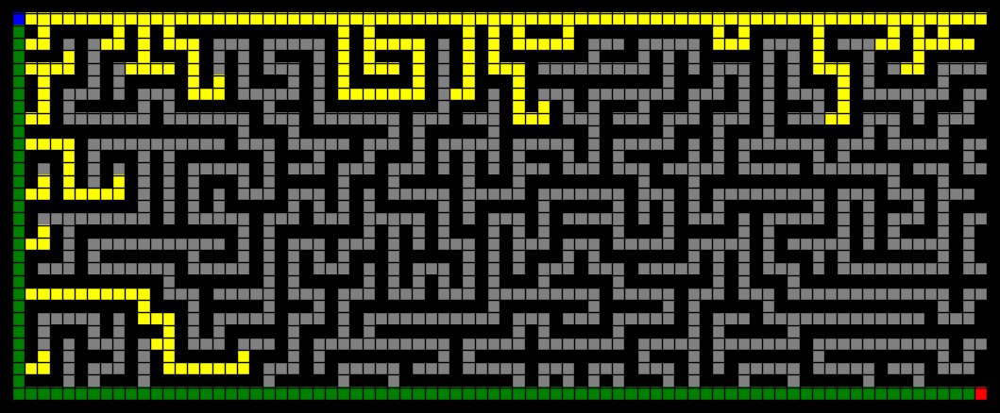

## Usage
```bash
python maze.py <maze_file> <algorithm: DFS | BFS | A*> [options: show_info | show_frontier | show_image]
```

# Maze Solutions

## Solved using Depth First Search – 1,131 iterations


## Solved using Breadth First Search – 13,870 iterations


## Solved using A* Search – 340 iterations

